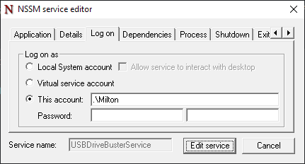
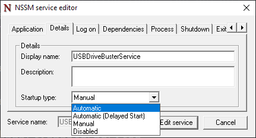

# USB Drive Buster

Bust anyone who connects a USB drive to cheat in practical examinations.

## Why I created this?

As practical examinations in computer science involve writing code, students tend to bring in USB flash drives with source code stored in it and the invigilators may be unaware of this so I decided to implement this system for my college as it was needed.

## Working

The script runs as a service in the background and monitors for USB flash drives connected to the computer and logs the details to a file *usbdrivebuster.log* which contains info about when the device was connected/disconnected, vendor & product name, serial id and the drive size. It also a sends a message via telegram so that the invigilators can know about it. 

## Prerequisites
* PowerShell 6.1.0 (or higher)
* [PoshGram](https://www.powershellgallery.com/packages/PoshGram/2.0.0) module installed
* Telegram requirements
    * Telegram account
    * Group chat created with [bot](https://core.telegram.org/bots#how-do-i-create-a-bot) as a member
    * Group chat ID (refer this [video](https://youtu.be/UPC5Ck1oU6k?feature=shared&t=17))

## Setup
### Set bot token and chat ID
In the `main.ps1` script file paste the bot token and chat ID
```
$telegramBotToken = "nnnnnnnnn:xxxxxxx-xxxxxxxxxxxxxxxxxxxxxxxxxxx"
$telegramGroupChatId = "-nnnnnnnnn"
```

### Create a service (Windows)

1. Install [`nssm`](https://scoop.sh/#/apps?q=nssm&id=9bb530a6593cf96fd08e6f78dd9724f5810faeb8) from the scoop package manager
2. Create a service

    ```powershell
    nssm install <service name> "C:\path\to\pwsh.exe" "-ExecutionPolicy Bypass -File C:\path\to\main.ps1"
    ```
    **NOTE**: *The absolute path to the* `pwsh.exe` *and* `main.ps1` *should be specified*.
3. Configure the service

    ```powershell
    nssm edit <service name>
    ```

    Specify the username and password for the user account: `Log on > This account`, click `Edit service` to save changes.

    

## Usage
By default the service won't start automatically at startup. This can be changed by editing `Details > Startup type`

  

### Service Operations
You can manage the service via the Task Manager: `Task Manager > Services`, here you can right-click and select the operation you want. This can also be done from the command-line with the commands mentioned below for **Command Prompt** and **PowerShell**.

**NOTE**: *The following operations should be run with administrator privileges*.  

1. Start the service

    ```powershell
    # cmd
    net start USBDriveBusterService

    # powershell
    Start-Service -Name USBDriveBusterService
    ```
2. Stop the service

    ```powershell
    # cmd
    net stop USBDriveBusterService

    # powershell
    Stop-Service -Name USBDriveBusterService
    ```
3. Restart the service

    ```powershell
    # cmd
    net restart USBDriveBusterService

    # powershell
    Restart-Service -Name USBDriveBusterService
    ```
4. Remove the service

    ```powershell
    nssm remove USBDriveBusterService
    ```
